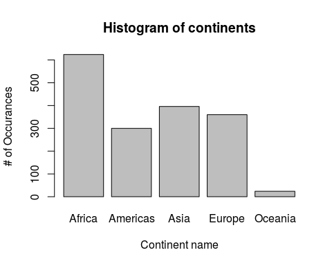
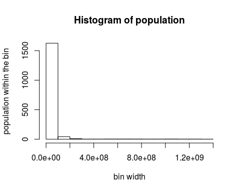
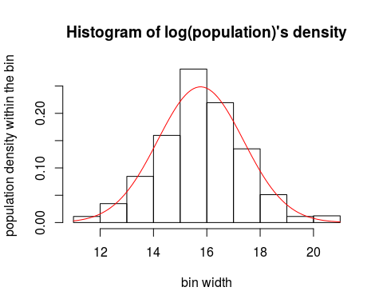
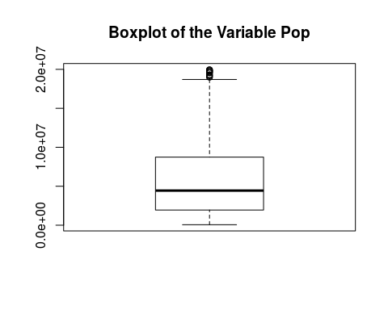
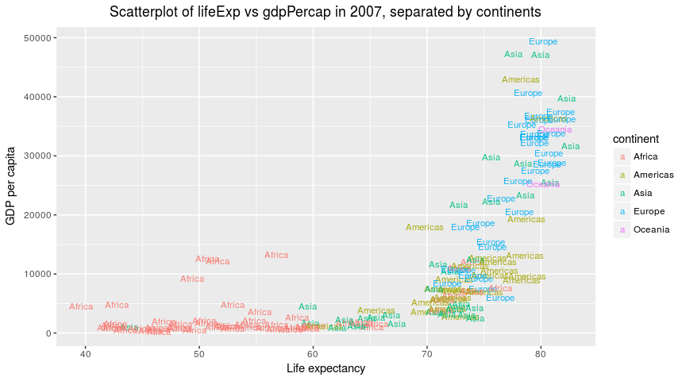
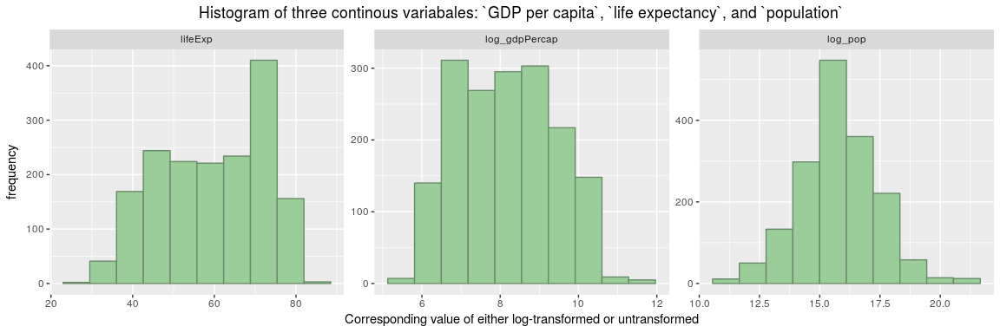
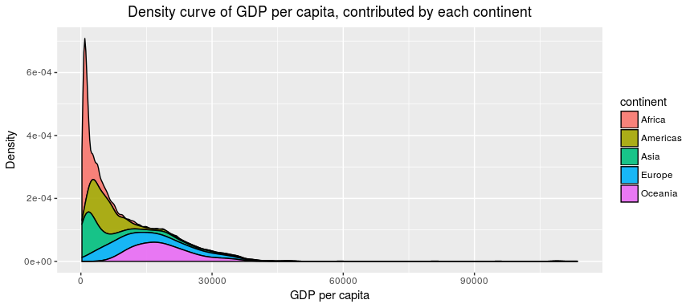
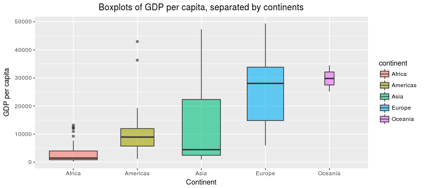

HW2 Gapminder Exploration Using Package(dplyr)
================

Pre-Work
--------

#### Load packages

Load the necessary package (assuming you have installed them)

``` r
library(dplyr)
library(gapminder)
library(ggplot2)
library(tidyr)
```

Get an overview
---------------

#### Is it a data.frame, a matrix, a vector, a list?

-   data.frame

#### What is its class?

-   `tbl_df`, `tbl` and `data.frame`

#### How many variables/columns?

-   6 variables/columns

#### How many rows/observations?

-   1704 obs.

#### What data type of each variable?

-   variable of `country`: factor
-   variable of `continent`: factor
-   variable of `year`: int
-   variable of `lifeExp`: num/double
-   variable of `pop`: int
-   variable of `gdpPercap`: num/double

``` r
str(gapminder)
```

    ## Classes 'tbl_df', 'tbl' and 'data.frame':    1704 obs. of  6 variables:
    ##  $ country  : Factor w/ 142 levels "Afghanistan",..: 1 1 1 1 1 1 1 1 1 1 ...
    ##  $ continent: Factor w/ 5 levels "Africa","Americas",..: 3 3 3 3 3 3 3 3 3 3 ...
    ##  $ year     : int  1952 1957 1962 1967 1972 1977 1982 1987 1992 1997 ...
    ##  $ lifeExp  : num  28.8 30.3 32 34 36.1 ...
    ##  $ pop      : int  8425333 9240934 10267083 11537966 13079460 14880372 12881816 13867957 16317921 22227415 ...
    ##  $ gdpPercap: num  779 821 853 836 740 ...

#### Can you get these facts about `extent` or `size` in more than one way? Can you imagine different functions being useful in different contexts?

-   Other ways: see below. str() can be used when wanting to have an idea of the dataset. dim() can be used when only care about the dimensions of the dataset; Inputting the name of the dataset can be a shortcut of dim(data) + head(data).

``` r
dim(gapminder)
```

    ## [1] 1704    6

``` r
gapminder
```

    ## # A tibble: 1,704 x 6
    ##        country continent  year lifeExp      pop gdpPercap
    ##         <fctr>    <fctr> <int>   <dbl>    <int>     <dbl>
    ##  1 Afghanistan      Asia  1952  28.801  8425333  779.4453
    ##  2 Afghanistan      Asia  1957  30.332  9240934  820.8530
    ##  3 Afghanistan      Asia  1962  31.997 10267083  853.1007
    ##  4 Afghanistan      Asia  1967  34.020 11537966  836.1971
    ##  5 Afghanistan      Asia  1972  36.088 13079460  739.9811
    ##  6 Afghanistan      Asia  1977  38.438 14880372  786.1134
    ##  7 Afghanistan      Asia  1982  39.854 12881816  978.0114
    ##  8 Afghanistan      Asia  1987  40.822 13867957  852.3959
    ##  9 Afghanistan      Asia  1992  41.674 16317921  649.3414
    ## 10 Afghanistan      Asia  1997  41.763 22227415  635.3414
    ## # ... with 1,694 more rows

``` r
class(gapminder)
```

    ## [1] "tbl_df"     "tbl"        "data.frame"

Explore Individual Variables
----------------------------

#### Pick the categorical variable: `continent`:

-   What are possible values (or range, whichever is appropriate) of the variable?
    -   Possible values are `Africa`, `Americas`, `Asia`, `Europe`, and `Oceania`.

``` r
summary(gapminder$continent)
```

    ##   Africa Americas     Asia   Europe  Oceania 
    ##      624      300      396      360       24

``` r
str(gapminder$continent)
```

    ##  Factor w/ 5 levels "Africa","Americas",..: 3 3 3 3 3 3 3 3 3 3 ...

-   What values are typical?
    -   Among 5 continents, `Africa` appears the highest times (624), `Oceania` appears the lowest times(24)
-   Feel free to use summary stats, tables, figures.

``` r
plot(gapminder$continent, 
     main = "Histogram of continents", 
     xlab = "Continent name",
     ylab = "# of Occurances")
```



``` r
gapminder %>%
    group_by(continent) %>%
    summarise (n = n()) %>%
    mutate(freq = n / sum(n))
```

    ## # A tibble: 5 x 3
    ##   continent     n       freq
    ##      <fctr> <int>      <dbl>
    ## 1    Africa   624 0.36619718
    ## 2  Americas   300 0.17605634
    ## 3      Asia   396 0.23239437
    ## 4    Europe   360 0.21126761
    ## 5   Oceania    24 0.01408451

#### Pick the quantitative variable: `pop`.

-   What are possible values (or range, whichever is appropriate) of the variable?
    -   The range of variable pop is from min = 6.001e+04 to max = 1.319e+09, all values in between them are possible values.

``` r
summary(gapminder$pop)
```

    ##      Min.   1st Qu.    Median      Mean   3rd Qu.      Max. 
    ## 6.001e+04 2.794e+06 7.024e+06 2.960e+07 1.959e+07 1.319e+09

-   What values are typical? What is the spread? What is the distribution?

    -   From the histogram, it can be seem the frequency between 0 to 1e+08 is highest, so the values falls within \[0,1e+08\] are typical.
    -   The sd of the variable is 1.06e+8, and the IQR of the variable is 1.67e+7.
    -   In order to find the distribution, because previous histogram is right skewed, so I took the log on the variable `pop` and compare with the normal distribution, surprisingly, they look similar, so it is reasonable to asusme the log of the variable `pop` follows a normal distribution.

``` r
sqrt(var(gapminder$pop))
```

    ## [1] 106157897

``` r
IQR(gapminder$pop)
```

    ## [1] 16791558

``` r
hist(gapminder$pop,
     main = "Histogram of population", 
     xlab = "bin width",
     ylab = "population within the bin")
```



``` r
trans.pop <- log(gapminder$pop)

hist(trans.pop, freq = FALSE, breaks = 14,     
     main = "Histogram of log(population)'s density", 
     xlab = "bin width",
     ylab = "population density within the bin")
curve(dnorm(x, mean=mean(trans.pop), sd=sd(trans.pop)), col="red", add=TRUE)
```



-   Feel free to use summary stats, tables, figures.

``` r
filter(gapminder, pop < 2e+7) %>%
  select(pop) %>%
  boxplot(main = "Boxplot of the Variable Pop")
```



#### Pick the quantitative variable: `year`:

-   What are possible values (or range, whichever is appropriate) of the variable?

-   Even though this is a numeric variable, it only contains 12 possible values of year: 1952 1957 1962 1967 1972 1977 1982 1987 1992 1997 2002 2007.

``` r
unique(gapminder$year)
```

    ##  [1] 1952 1957 1962 1967 1972 1977 1982 1987 1992 1997 2002 2007

``` r
n_distinct(gapminder$year)
```

    ## [1] 12

-   What values are typical? What is the spread? What is the distribution?

-   All possible values of years have the same occurances. i.e. are evenly spread because all years have the same number of occurrences, so the distribution might be uniform if we consider year as continuous random variable. In terms of spread, the sd of year is 17.265 and the IQR of the var `year` is 27.5.

``` r
table(gapminder$year)
```

    ## 
    ## 1952 1957 1962 1967 1972 1977 1982 1987 1992 1997 2002 2007 
    ##  142  142  142  142  142  142  142  142  142  142  142  142

``` r
sqrt(var(gapminder$year))
```

    ## [1] 17.26533

``` r
IQR(gapminder$year)
```

    ## [1] 27.5

Explore various plot types
--------------------------

#### Scatterplot of two quantitative variables.

-   Scatterplot of `year` vs `lifeExp`, choosing the level of alpha transparency to be 0.7, and separating the continents using different colors, and sizing the points based on the relevant population.

``` r
gapminder %>%
  ggplot(aes(x= year, y=lifeExp, size = pop)) +
  geom_point(alpha= 0.7, aes(col = continent)) +
  xlab("Year") +
  ylab("Life expectancy") +
  ggtitle("Scatterplot of year vs lifeExp, colored by continents and sized by corresponding population") +
  theme(plot.title = element_text(hjust = 0.5))
```


-   Scatterplot of `lifeExp` vs `gdpPercap` in the year of 2007, choosing the level of alpha transparency to be 0.9, and separating the continents using different colors, and label each point using its continent name.

``` r
gapminder %>%
  filter(year == 2007) %>%
  ggplot(aes(x=lifeExp, y = gdpPercap, label = as.character(continent), color = continent)) + 
  geom_text(size=3, alpha = 0.9) + 
  xlab("Life expectancy") +
  ylab("GDP per capita") +
  ggtitle("Scatterplot of lifeExp vs gdpPercap in 2007, separated by continents") +
  theme(plot.title = element_text(hjust = 0.5))
```



-   Linear models fitting `gdpPercap` vs `pop` in Oceania, separated by countries using different shapes of points, which colored by the year.

``` r
gapminder %>%
  filter(continent == "Oceania") %>% 
  ggplot(aes(x=gdpPercap, y=pop)) +
  geom_point(aes(color = year, shape = country), size = 3) + 
  geom_smooth(aes(linetype = country), color = "green", method = "lm") +
  xlab("GDP per capita") + 
  ylab("Population") +   
  ggtitle("Linear models fitting gdpPercap vs pop in the continent of Oceania, separated by contries, colored by years.") +
  theme(plot.title = element_text(hjust = 0.5))
```


#### Plot of one quantitative variable. Maybe a histogram or densityplot or frequency polygon.

-   Histograms of lifeExp, log(gdpPercap), and log(pop).

``` r
gathered.gap <-
  gapminder %>%
  mutate(log_pop= log(pop), log_gdpPercap = log(gdpPercap)) %>%
  select(-c(pop, gdpPercap)) %>%
  gather(key, value, -country, -c(continent:year))

gathered.gap %>%
  ggplot(aes(value)) + 
  geom_histogram(bins=10, color = "darkseagreen4", fill = "darkseagreen3") +
  facet_wrap(~key, scales="free", nrow = 1) + 
  xlab("Corresponding value of either log-transformed or untransformed") +
  ylab("frequency") +
  ggtitle("Histogram of three continous variabales: `GDP per capita`, `life expectancy`, and `population`") +
  theme(plot.title = element_text(hjust = 0.5))
```



-   Density plot of gdpPercap, contributed by each continent

``` r
gapminder %>%
  ggplot(aes(gdpPercap)) + 
  geom_density(aes(fill = continent), alpha = 0.9, position = "stack") +
  xlab("GDP per capita") +
  ylab("Density") +
  ggtitle("Density curve of GDP per capita, contributed by each continent") +
  theme(plot.title = element_text(hjust = 0.5))
```



#### Plot of one quantitative variable and one categorical. Maybe boxplots for several continents or countries.

-   Boxplots of `gdpPercap` separated by continents

``` r
gapminder %>%
  filter(year == 2007) %>%
  ggplot(aes(x= continent, y = gdpPercap)) + 
  geom_boxplot(varwidth= T, aes(fill = continent), alpha = 0.6) +
  xlab("Continent") +
  ylab("GDP per capita") +
  ggtitle("Boxplots of GDP per capita, separated by continents") +
  theme(plot.title = element_text(hjust = 0.5))
```



-   Compare the `gdpPercap` each year between US and Canada

``` r
gpm <-
  gapminder%>%
  filter(country %in% c("United States", "Canada")) %>%
  mutate(gdpPC = replace(gdpPercap, country =="Canada", -gdpPercap)) %>%
  select(c(country, year, gdpPC)) %>%
  arrange(country, year)
```

    ## Warning in replace(gdpPercap, country == "Canada", -gdpPercap): number of
    ## items to replace is not a multiple of replacement length

``` r
brks <- seq(-45000, 45000, 15000)
lbls <- paste0(as.character(c(seq(-45, 0, 15), seq(15, 45, 15))), "k")
gpm %>%
  ggplot(aes(x = as.factor(-year), y = gdpPC, fill = country)) +  
  geom_bar(stat = "identity", width = .6) + 
  scale_y_continuous(breaks = brks, labels = lbls) + 
                              coord_flip() + 
                              labs(title="GDP Per Capita") + 
                              #theme_tufte() + 
                              theme(plot.title = element_text(hjust = .5), 
                                    axis.ticks = element_blank()) +
                              scale_fill_brewer(palette = "Dark2") +
  scale_x_discrete(label = seq(2007, 1952, by = -5)) + 
  ylab("GDP per capita") +
  xlab("Year") + 
  ggtitle("US vs Canada: GDP per capita for year from 1952 to 2007")
```


Report your process
-------------------

-   #### Reflect on what was hard/easy:

    As a stat student who has some backgrounds in ggplot and dplyr, I think the hardest parts are to think creatively how to setting up an aspect to explore within the data because you have so many choices to do. However, once all the exploration part has been setting up, making the code is relatively easy.

-   #### Problems you solved, helpful tutorials you read, etc.

-   When I was using ggplot to plot the figures, I kept receiving the error: Mapping must be created by `aes()` or `aes_()`. My first thought is that probably what is inside my ggplot() is incorrect, after rechecking quite a few times with lecture notes and still no luck, so I googled search on the error and from stackoverflow website, I finally realized that I was using pipeline to add the layer instead of +, which is correct way of add layers in ggplot. Sometimes, a small error could crash the whole chunck of code, and the small error is really hard to locate.
-   When I was using boxplot to generate the gdpPercap for five countries, I always got five lines, rather than 5 boxplots. I thought maybe I was using the argument wrong, however, I tried out other variables and found that because the y scale is too large, each line is actually a boxplot, but compressed so much that makes it looks like a line.

``` r
gapminder %>%
  filter(country %in% c("United States","France", "Japan", "China"), year == 2007) %>%
  ggplot(aes(x= country, y = gdpPercap)) + 
  geom_boxplot() +
  ggtitle("Problem encountered when doing boxplot") +
  theme(plot.title = element_text(hjust = 0.5))
```


-   #### What things were hard, even though you saw them in class? What was easy(-ish) even though we haven’t done it in class?

    For me, how to make the code in the neat and clean way is hard. As my usual rule is as long as the code and graphs achive my goals, they are good. So my coding style and graph might not be that appealing and easy to read. However, now I have to spend some time to pender how to make the graphs more attractive, and
