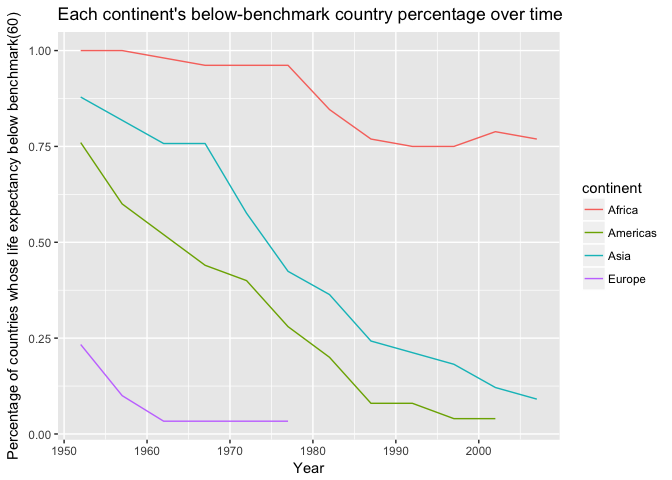

HW3 Gapminder Exploration Using Package(dplyr)
================

Pre-Work
--------

#### Load packages

Load the necessary package (assuming you have installed them)

``` r
library(dplyr)
library(gapminder)
library(ggplot2)
library(tidyr)
```

1.Get the maximum and minimum of GDP per capita for all continents.
-------------------------------------------------------------------

``` r
tbl1 <- 
  gapminder %>% 
  group_by(continent) %>% 
  summarise(minGDP = min(gdpPercap), medianGDP = median(gdpPercap), maxGDP = max(gdpPercap))
knitr::kable(tbl1)
```

| continent |      minGDP|  medianGDP|     maxGDP|
|:----------|-----------:|----------:|----------:|
| Africa    |    241.1659|   1192.138|   21951.21|
| Americas  |   1201.6372|   5465.510|   42951.65|
| Asia      |    331.0000|   2646.787|  113523.13|
| Europe    |    973.5332|  12081.749|   49357.19|
| Oceania   |  10039.5956|  17983.304|   34435.37|

``` r
tbl1 %>%
  ggplot(aes(x= continent, y = medianGDP, color=continent)) + 
  geom_crossbar(aes(ymin  = minGDP, ymax = maxGDP), position = "dodge", width = 0.45) +
  xlab("Continent") +
  ylab("GDP per capita") +
  ggtitle("Range of GDP per capita separated by continent")
```


2.Look at the spread of GDP per capita within the continents.
-------------------------------------------------------------

Look at the IQR

``` r
tbl2 <-
  gapminder %>%
  group_by(continent) %>%
  summarise(`25%Q`=quantile(gdpPercap, probs=0.25),
            `50%Q`=quantile(gdpPercap, probs=0.5),
            `75%Q`=quantile(gdpPercap, probs=0.75))
knitr::kable(tbl2)
```

| continent |       25%Q|       50%Q|       75%Q|
|:----------|----------:|----------:|----------:|
| Africa    |    761.247|   1192.138|   2377.417|
| Americas  |   3427.779|   5465.510|   7830.210|
| Asia      |   1056.993|   2646.787|   8549.256|
| Europe    |   7213.085|  12081.749|  20461.386|
| Oceania   |  14141.859|  17983.304|  22214.117|

``` r
gapminder %>%
  ggplot(aes(x= continent, y = gdpPercap, color=continent)) + 
  geom_boxplot() +
  xlab("Continent") +
  ylab("GDP per capita") +
  ggtitle("Boxplot of GDP per capita separated by continent")
```


3.Compute a trimmed mean of life expectancy for different years. Or a weighted mean, weighting by population. Just try something other than the plain vanilla mean.
-------------------------------------------------------------------------------------------------------------------------------------------------------------------

``` r
# Weighted mean
gapminder %>%
  group_by(year) %>%
  mutate(weighted_lifeE = weighted.mean(lifeExp, pop)) %>%
  select(year, weighted_lifeE) %>%
  distinct(year, weighted_lifeE) %>%
  knitr::kable()
```

|  year|  weighted\_lifeE|
|-----:|----------------:|
|  1952|         48.94424|
|  1957|         52.12189|
|  1962|         52.32438|
|  1967|         56.98431|
|  1972|         59.51478|
|  1977|         61.23726|
|  1982|         62.88176|
|  1987|         64.41635|
|  1992|         65.64590|
|  1997|         66.84934|
|  2002|         67.83904|
|  2007|         68.91909|

``` r
gapminder %>%
  group_by(year) %>%
  mutate(totPop = sum(as.numeric(pop)), 
         weighted_lifeE = weighted.mean(lifeExp, pop)) %>%
  ggplot(aes(x = year, y = weighted_lifeE, size = totPop)) +
  geom_point()+
  xlab("Year") +
  ylab("Weighted life expectancy with the weight of population") +
  ggtitle("Population-weighted life expectancy changes over time")
```


``` r
# 10% Trimmed Mean: Remove the top and bottom 10% (#14) of data
gapminder %>%
  group_by(year) %>%
  mutate(trimed_mean = mean(lifeExp, trim = .1)) %>%
  distinct(year, trimed_mean) %>%
  knitr::kable()
```

|  year|  trimed\_mean|
|-----:|-------------:|
|  1952|      48.57668|
|  1957|      51.26888|
|  1962|      53.58075|
|  1967|      55.86538|
|  1972|      58.01444|
|  1977|      60.10206|
|  1982|      62.11694|
|  1987|      63.92106|
|  1992|      65.18519|
|  1997|      66.01736|
|  2002|      66.71641|
|  2007|      68.11489|

4.How is life expectancy changing over time on different continents?
--------------------------------------------------------------------

``` r
tbl4 <- 
  gapminder %>%
  select(continent, year, lifeExp)
knitr::kable(head(tbl4))
```

| continent |  year|  lifeExp|
|:----------|-----:|--------:|
| Asia      |  1952|   28.801|
| Asia      |  1957|   30.332|
| Asia      |  1962|   31.997|
| Asia      |  1967|   34.020|
| Asia      |  1972|   36.088|
| Asia      |  1977|   38.438|

``` r
tbl4 %>%
  ggplot(aes(x = year, y = lifeExp)) + 
  facet_wrap(~continent) + 
  geom_point(alpha = 0.35, color = "dark blue") + 
  geom_smooth(method = "loess") +
  xlab("Year") +
  ylab("Life expectancy") +
  ggtitle("Life expectancy changes over time for each continent")
```


5.Report the absolute and/or relative abundance of countries with low life expectancy over time by continent
------------------------------------------------------------------------------------------------------------

``` r
#BenchMark: median of lifeExp
benchmark <- 60
tbl5 <- 
  gapminder %>%
  group_by(continent, year) %>% 
  mutate(NumOfCountries = n(), shareOfThisCountry = 1/NumOfCountries) %>%
  filter(lifeExp < benchmark) %>%
  summarise(n = n(), perCen = sum(shareOfThisCountry))

knitr::kable(head(tbl5))
```

| continent |  year|    n|     perCen|
|:----------|-----:|----:|----------:|
| Africa    |  1952|   52|  1.0000000|
| Africa    |  1957|   52|  1.0000000|
| Africa    |  1962|   51|  0.9807692|
| Africa    |  1967|   50|  0.9615385|
| Africa    |  1972|   50|  0.9615385|
| Africa    |  1977|   50|  0.9615385|

``` r
tbl5 %>%
  ggplot(aes(x= year, y = perCen, group= continent, color= continent)) +
  geom_line() +
  xlab("Year") +
  ylab("Percentage of countries whose life expectancy below benchmark(60)") +
  ggtitle("Each continent's below-benchmark country percentage over time")
```



6.Make up your own: The absolute increase population
----------------------------------------------------

The population increase is `pop` of the current year minus previous year, and group by continent and see whether the year increase differ by the continent.

``` r
delta <- function(x){
  x.lag <- lag(x)
  x.delta <- x - x.lag
  return(x.delta)
}

tbl6 <- 
  gapminder%>%
  group_by(continent, year) %>%
  summarise(totPop = sum(as.numeric(pop))) %>%
  mutate(delta = delta(totPop)) %>%
  na.omit()
knitr::kable(head(tbl6))
```

| continent |  year|     totPop|     delta|
|:----------|-----:|----------:|---------:|
| Africa    |  1957|  264837738|  27197237|
| Africa    |  1962|  296516865|  31679127|
| Africa    |  1967|  335289489|  38772624|
| Africa    |  1972|  379879541|  44590052|
| Africa    |  1977|  433061021|  53181480|
| Africa    |  1982|  499348587|  66287566|

``` r
tbl6 %>%
  ggplot(aes(x = year, y = delta, color = continent, group= continent)) +
  geom_line() + 
  geom_point() +
  xlab("Year") +
  ylab("Increase in the population") +
  ggtitle("The increase in population over time separated by continent")
```


7.Find countries with interesting stories.
------------------------------------------

I compare the GDP increase percentage between two countries. It can be seen China has an increasing GDP increase per capita, and Japan has a decreasing increase per capita.

``` r
deltaPC <- function(x){
  x.lag <- lag(x)
  x.delta <- (x - x.lag)/x.lag
  return(x.delta)
}

tbl7 <- 
  gapminder %>%
  filter(country %in% c("China", "Japan"))%>%
  group_by(country) %>%
  mutate(gdpIncPC = deltaPC(gdpPercap)) %>%
  na.omit()
knitr::kable(tbl7)
```

| country | continent |  year|   lifeExp|         pop|   gdpPercap|    gdpIncPC|
|:--------|:----------|-----:|---------:|-----------:|-----------:|-----------:|
| China   | Asia      |  1957|  50.54896|   637408000|    575.9870|   0.4383543|
| China   | Asia      |  1962|  44.50136|   665770000|    487.6740|  -0.1533246|
| China   | Asia      |  1967|  58.38112|   754550000|    612.7057|   0.2563837|
| China   | Asia      |  1972|  63.11888|   862030000|    676.9001|   0.1047720|
| China   | Asia      |  1977|  63.96736|   943455000|    741.2375|   0.0950471|
| China   | Asia      |  1982|  65.52500|  1000281000|    962.4214|   0.2983982|
| China   | Asia      |  1987|  67.27400|  1084035000|   1378.9040|   0.4327446|
| China   | Asia      |  1992|  68.69000|  1164970000|   1655.7842|   0.2007973|
| China   | Asia      |  1997|  70.42600|  1230075000|   2289.2341|   0.3825680|
| China   | Asia      |  2002|  72.02800|  1280400000|   3119.2809|   0.3625871|
| China   | Asia      |  2007|  72.96100|  1318683096|   4959.1149|   0.5898263|
| Japan   | Asia      |  1957|  65.50000|    91563009|   4317.6944|   0.3421675|
| Japan   | Asia      |  1962|  68.73000|    95831757|   6576.6495|   0.5231855|
| Japan   | Asia      |  1967|  71.43000|   100825279|   9847.7886|   0.4973869|
| Japan   | Asia      |  1972|  73.42000|   107188273|  14778.7864|   0.5007213|
| Japan   | Asia      |  1977|  75.38000|   113872473|  16610.3770|   0.1239338|
| Japan   | Asia      |  1982|  77.11000|   118454974|  19384.1057|   0.1669877|
| Japan   | Asia      |  1987|  78.67000|   122091325|  22375.9419|   0.1543448|
| Japan   | Asia      |  1992|  79.36000|   124329269|  26824.8951|   0.1988275|
| Japan   | Asia      |  1997|  80.69000|   125956499|  28816.5850|   0.0742478|
| Japan   | Asia      |  2002|  82.00000|   127065841|  28604.5919|  -0.0073566|
| Japan   | Asia      |  2007|  82.60300|   127467972|  31656.0681|   0.1066778|

``` r
tbl7 %>%
  ggplot(aes(x = year, y = gdpIncPC, color = country)) + 
  geom_point() + 
  geom_smooth(method = "lm")+
  xlab("Year") +
  ylab("Increase in the GDP per capita") +
  ggtitle("Increase in the GDP per capita over time for country China and Japan")
```


