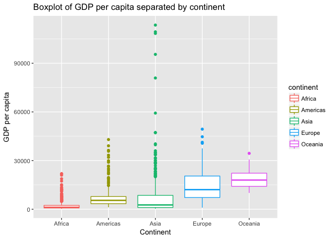

HW3 Gapminder Exploration Using Package(dplyr)
================

Pre-Work
--------

#### Load packages

Load the necessary package (assuming you have installed them)

``` r
library(dplyr)
library(gapminder)
library(ggplot2)
library(tidyr)
```

1.Get the maximum and minimum of GDP per capita for all continents.
-------------------------------------------------------------------

``` r
tbl1 <- 
  gapminder %>% 
  group_by(continent) %>% 
  summarise(minGDP = min(gdpPercap), medianGDP = median(gdpPercap), maxGDP = max(gdpPercap))
knitr::kable(tbl1, digits = 2, align = "r", padding = 10)
```

|  continent|    minGDP|  medianGDP|     maxGDP|
|----------:|---------:|----------:|----------:|
|     Africa|    241.17|    1192.14|   21951.21|
|   Americas|   1201.64|    5465.51|   42951.65|
|       Asia|    331.00|    2646.79|  113523.13|
|     Europe|    973.53|   12081.75|   49357.19|
|    Oceania|  10039.60|   17983.30|   34435.37|

``` r
tbl1 %>%
  ggplot(aes(x= continent, y = medianGDP, color=continent)) + 
  geom_crossbar(aes(ymin  = minGDP, ymax = maxGDP), position = "dodge", width = 0.45) +
  xlab("Continent") +
  ylab("GDP per capita") +
  ggtitle("Range of GDP per capita separated by continent")
```


Note: The graph displaying max and min is not boxplot!

2.Look at the spread of GDP per capita within the continents.
-------------------------------------------------------------

Look at the IQR

``` r
tbl2 <-
  gapminder %>%
  group_by(continent) %>%
  summarise(`25%Q`=quantile(gdpPercap, probs=0.25),
            `50%Q`=quantile(gdpPercap, probs=0.5),
            `75%Q`=quantile(gdpPercap, probs=0.75))
knitr::kable(tbl2, digits = 2, align = "r", padding = 10)
```

|  continent|      25%Q|      50%Q|      75%Q|
|----------:|---------:|---------:|---------:|
|     Africa|    761.25|   1192.14|   2377.42|
|   Americas|   3427.78|   5465.51|   7830.21|
|       Asia|   1056.99|   2646.79|   8549.26|
|     Europe|   7213.09|  12081.75|  20461.39|
|    Oceania|  14141.86|  17983.30|  22214.12|

``` r
gapminder %>%
  ggplot(aes(x= continent, y = gdpPercap, color=continent)) + 
  geom_boxplot() +
  xlab("Continent") +
  ylab("GDP per capita") +
  ggtitle("Boxplot of GDP per capita separated by continent")
```



Since it is not quite clearly displayed with current settings of y-labs, I changed the y-labs to the log10 scale, and check it out!

``` r
gapminder %>%
  ggplot(aes(x= continent, y = gdpPercap, color=continent)) + 
  geom_boxplot() +
  xlab("Continent") +
  ylab("GDP per capita") + 
  scale_y_log10() +
  ggtitle("Boxplot of GDP per capita separated by continent")
```


3.Compute a trimmed mean of life expectancy for different years. Or a weighted mean, weighting by population. Just try something other than the plain vanilla mean.
-------------------------------------------------------------------------------------------------------------------------------------------------------------------

``` r
# Weighted mean
gapminder %>%
  group_by(year) %>%
  mutate(weighted_lifeE = weighted.mean(lifeExp, pop)) %>%
  select(year, weighted_lifeE) %>%
  distinct(year, weighted_lifeE) %>%
  knitr::kable(digits = 2, align = "r", padding = 10)
```

|  year|  weighted\_lifeE|
|-----:|----------------:|
|  1952|            48.94|
|  1957|            52.12|
|  1962|            52.32|
|  1967|            56.98|
|  1972|            59.51|
|  1977|            61.24|
|  1982|            62.88|
|  1987|            64.42|
|  1992|            65.65|
|  1997|            66.85|
|  2002|            67.84|
|  2007|            68.92|

``` r
gapminder %>%
  group_by(year) %>%
  mutate(totPop = sum(as.numeric(pop)), 
         weighted_lifeE = weighted.mean(lifeExp, pop)) %>%
  ggplot(aes(x = year, y = weighted_lifeE, size = totPop)) +
  geom_point()+
  xlab("Year") +
  ylab("Weighted life expectancy with the weight of population") +
  ggtitle("Population-weighted life expectancy changes over time")
```


``` r
# 10% Trimmed Mean: Remove the top and bottom 10% (#14) of data
gapminder %>%
  group_by(year) %>%
  mutate(trimed_mean = mean(lifeExp, trim = .1)) %>%
  distinct(year, trimed_mean) %>%
  knitr::kable(digits = 2, align = "r", padding = 10)
```

|  year|  trimed\_mean|
|-----:|-------------:|
|  1952|         48.58|
|  1957|         51.27|
|  1962|         53.58|
|  1967|         55.87|
|  1972|         58.01|
|  1977|         60.10|
|  1982|         62.12|
|  1987|         63.92|
|  1992|         65.19|
|  1997|         66.02|
|  2002|         66.72|
|  2007|         68.11|

4.How is life expectancy changing over time on different continents?
--------------------------------------------------------------------

``` r
tbl4 <- 
  gapminder %>%
  select(continent, year, lifeExp)
tbl4 %>%
  head(15) %>%
  knitr::kable(digits = 2, align = "r", padding = 10)
```

|  continent|  year|  lifeExp|
|----------:|-----:|--------:|
|       Asia|  1952|    28.80|
|       Asia|  1957|    30.33|
|       Asia|  1962|    32.00|
|       Asia|  1967|    34.02|
|       Asia|  1972|    36.09|
|       Asia|  1977|    38.44|
|       Asia|  1982|    39.85|
|       Asia|  1987|    40.82|
|       Asia|  1992|    41.67|
|       Asia|  1997|    41.76|
|       Asia|  2002|    42.13|
|       Asia|  2007|    43.83|
|     Europe|  1952|    55.23|
|     Europe|  1957|    59.28|
|     Europe|  1962|    64.82|

``` r
# Due to the table is super long, we just display the head 15 rows of the table
```

``` r
tbl4 %>%
  ggplot(aes(x = year, y = lifeExp)) + 
  facet_wrap(~continent) + 
  geom_point(alpha = 0.35, color = "dark blue") + 
  geom_smooth(method = "loess") +
  xlab("Year") +
  ylab("Life expectancy") +
  ggtitle("Life expectancy changes over time for each continent")
```


5.Report the absolute and/or relative abundance of countries with low life expectancy over time by continent
------------------------------------------------------------------------------------------------------------

``` r
#BenchMark: median of lifeExp
benchmark <- 60
tbl5 <- 
  gapminder %>%
  group_by(continent, year) %>% 
  mutate(NumOfCountries = n(), shareOfThisCountry = 1/NumOfCountries) %>%
  filter(lifeExp < benchmark) %>%
  summarise(n = n(), ratio = sum(shareOfThisCountry)) %>%
  mutate(`perCen%` = paste(round(ratio*100, 2), "%"))

tbl5 %>%
  head(15) %>%
  knitr::kable(digits = 2, align = "r", padding = 10)
```

|  continent|  year|    n|  ratio|  perCen%|
|----------:|-----:|----:|------:|--------:|
|     Africa|  1952|   52|   1.00|    100 %|
|     Africa|  1957|   52|   1.00|    100 %|
|     Africa|  1962|   51|   0.98|  98.08 %|
|     Africa|  1967|   50|   0.96|  96.15 %|
|     Africa|  1972|   50|   0.96|  96.15 %|
|     Africa|  1977|   50|   0.96|  96.15 %|
|     Africa|  1982|   44|   0.85|  84.62 %|
|     Africa|  1987|   40|   0.77|  76.92 %|
|     Africa|  1992|   39|   0.75|     75 %|
|     Africa|  1997|   39|   0.75|     75 %|
|     Africa|  2002|   41|   0.79|  78.85 %|
|     Africa|  2007|   40|   0.77|  76.92 %|
|   Americas|  1952|   19|   0.76|     76 %|
|   Americas|  1957|   15|   0.60|     60 %|
|   Americas|  1962|   13|   0.52|     52 %|

``` r
# Due to the table is super long, we just display the head 15 rows of the table
```

``` r
tbl5 %>%
  ggplot(aes(x= year, y = ratio, group= continent, color= continent)) +
  geom_line() +
  xlab("Year") +
  ylab("Ratio of countries whose lifeExp is below benchmark (60)") +
  ggtitle("Each continent's below-benchmark country percentage over time")
```


6.Make up your own: The absolute increase population
----------------------------------------------------

The population increase is `pop` of the current year minus previous year, and group by continent and see whether the year increase differ by the continent.

``` r
delta <- function(x){
  x.lag <- lag(x)
  x.delta <- x - x.lag
  return(x.delta)
}

tbl6 <- 
  gapminder%>%
  group_by(continent, year) %>%
  summarise(totPop = sum(as.numeric(pop))) %>%
  mutate(delta = delta(totPop)) %>%
  na.omit()
tbl6 %>%
  head(15) %>%
  knitr::kable(digits = 2, align = "r", padding = 10)
```

|  continent|  year|     totPop|     delta|
|----------:|-----:|----------:|---------:|
|     Africa|  1957|  264837738|  27197237|
|     Africa|  1962|  296516865|  31679127|
|     Africa|  1967|  335289489|  38772624|
|     Africa|  1972|  379879541|  44590052|
|     Africa|  1977|  433061021|  53181480|
|     Africa|  1982|  499348587|  66287566|
|     Africa|  1987|  574834110|  75485523|
|     Africa|  1992|  659081517|  84247407|
|     Africa|  1997|  743832984|  84751467|
|     Africa|  2002|  833723916|  89890932|
|     Africa|  2007|  929539692|  95815776|
|   Americas|  1957|  386953916|  41801470|
|   Americas|  1962|  433270254|  46316338|
|   Americas|  1967|  480746623|  47476369|
|   Americas|  1972|  529384210|  48637587|

``` r
# Due to the table is super long, we just display the head 15 rows of the table
```

``` r
tbl6 %>%
  ggplot(aes(x = year, y = delta, color = continent, group= continent)) +
  geom_line() + 
  geom_point() +
  xlab("Year") +
  ylab("Increase in the population") +
  ggtitle("The increase in population over time separated by continent")
```


7.Find countries with interesting stories.
------------------------------------------

I compare the GDP increase percentage between two countries. It can be seen China has an increasing GDP increase per capita, and Japan has a decreasing increase per capita.

``` r
deltaPC <- function(x){
  x.lag <- lag(x)
  x.delta <- (x - x.lag)/x.lag
  return(x.delta)
}

tbl7 <- 
  gapminder %>%
  filter(country %in% c("China", "Japan"))%>%
  group_by(country) %>%
  mutate(gdpIncPC = deltaPC(gdpPercap)) %>%
  na.omit()
knitr::kable(tbl7, digits = 2, align = "r", padding = 10)
```

|  country|  continent|  year|  lifeExp|         pop|  gdpPercap|  gdpIncPC|
|--------:|----------:|-----:|--------:|-----------:|----------:|---------:|
|    China|       Asia|  1957|    50.55|   637408000|     575.99|      0.44|
|    China|       Asia|  1962|    44.50|   665770000|     487.67|     -0.15|
|    China|       Asia|  1967|    58.38|   754550000|     612.71|      0.26|
|    China|       Asia|  1972|    63.12|   862030000|     676.90|      0.10|
|    China|       Asia|  1977|    63.97|   943455000|     741.24|      0.10|
|    China|       Asia|  1982|    65.53|  1000281000|     962.42|      0.30|
|    China|       Asia|  1987|    67.27|  1084035000|    1378.90|      0.43|
|    China|       Asia|  1992|    68.69|  1164970000|    1655.78|      0.20|
|    China|       Asia|  1997|    70.43|  1230075000|    2289.23|      0.38|
|    China|       Asia|  2002|    72.03|  1280400000|    3119.28|      0.36|
|    China|       Asia|  2007|    72.96|  1318683096|    4959.11|      0.59|
|    Japan|       Asia|  1957|    65.50|    91563009|    4317.69|      0.34|
|    Japan|       Asia|  1962|    68.73|    95831757|    6576.65|      0.52|
|    Japan|       Asia|  1967|    71.43|   100825279|    9847.79|      0.50|
|    Japan|       Asia|  1972|    73.42|   107188273|   14778.79|      0.50|
|    Japan|       Asia|  1977|    75.38|   113872473|   16610.38|      0.12|
|    Japan|       Asia|  1982|    77.11|   118454974|   19384.11|      0.17|
|    Japan|       Asia|  1987|    78.67|   122091325|   22375.94|      0.15|
|    Japan|       Asia|  1992|    79.36|   124329269|   26824.90|      0.20|
|    Japan|       Asia|  1997|    80.69|   125956499|   28816.58|      0.07|
|    Japan|       Asia|  2002|    82.00|   127065841|   28604.59|     -0.01|
|    Japan|       Asia|  2007|    82.60|   127467972|   31656.07|      0.11|

``` r
tbl7 %>%
  ggplot(aes(x = year, y = gdpIncPC, color = country)) + 
  geom_point() + 
  geom_smooth(method = "lm")+
  xlab("Year") +
  ylab("Increase in the GDP per capita") +
  ggtitle("Increase in the GDP per capita over time for country China and Japan")
```


Report your process
-------------------

-   #### Reflect on what was hard/easy:

    I think this assignment is not too hard in general. I am familiar with the functions in dplyr, just need some practice with summarise() function, and need to check with the use of cumsum() function. The part that consumes me some time is to reformat. Additionally, I really invested quite a lot time making the table and figures side-by-side, and still could not make it. I followed Jenny's instructions step by step, but still achieve nothing. I hope to find a solution!

-   #### Problems you solved, helpful tutorials you read, etc.

-   When I was doing the weighted mean of lifeExp weighted by the population, I firstly wanted to add a column of the population weights, and manually calculated the weighted mean. After I did that, when I double checked my code, I was chanlleging myself: whether there is simpler way to do that? So I googled, and found yes! A really simple function: [weighted.mean()](https://stat.ethz.ch/R-manual/R-devel/library/stats/html/weighted.mean.html). Samed as trimmed mean.

-   #### What things were hard, even though you saw them in class? What was easy(-ish) even though we haven’t done it in class?

    Making the corresponding graphs without specific instructions how to do that was hard, especially for the weighted and trimmed mean. If any advises and comments, please let me know. Thanks.
