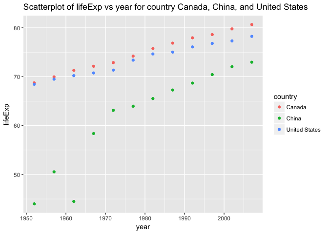
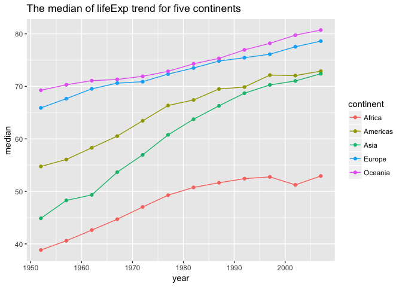

HW4 Tidy data and joins
================

Pre-Work
--------

#### Load packages

Load the necessary package (assuming you have installed them)

``` r
library(dplyr)
library(gapminder)
library(ggplot2)
library(tidyr)
library(countrycode)
```

Problem 1: General data reshaping and relationship to aggregation.
------------------------------------------------------------------

#### - Activity \#2

Make a tibble with one row per year and columns for life expectancy for two or more countries.

``` r
tbl1.2 <- 
  gapminder %>%
  filter(country %in% c("United States", "China", "Canada")) %>%
  select(country, year, lifeExp)

tbl1.2 %>%
  head(15) %>%
  knitr::kable(digits = 2, align ="r", padding = 10)
```

|  country|  year|  lifeExp|
|--------:|-----:|--------:|
|   Canada|  1952|    68.75|
|   Canada|  1957|    69.96|
|   Canada|  1962|    71.30|
|   Canada|  1967|    72.13|
|   Canada|  1972|    72.88|
|   Canada|  1977|    74.21|
|   Canada|  1982|    75.76|
|   Canada|  1987|    76.86|
|   Canada|  1992|    77.95|
|   Canada|  1997|    78.61|
|   Canada|  2002|    79.77|
|   Canada|  2007|    80.65|
|    China|  1952|    44.00|
|    China|  1957|    50.55|
|    China|  1962|    44.50|

``` r
#Due to the long table, we only display head 15 rows. 

tbl1.2 %>%
  ggplot(aes(x = year, y = lifeExp, color = country)) +
  geom_point() +
  ggtitle("Scatterplot of lifeExp vs year for country Canada, China, and United States")
```



#### - Activity \#3 Compute median of life expectancy for all possible combinations of continent and year.

``` r
tbl1.3 <- 
  gapminder %>%
  group_by(continent, year) %>%
  summarise(median = median(lifeExp))

tbl1.3 %>%
  head(15) %>%
  knitr::kable(digits = 2, align ="r", padding = 10)
```

|  continent|  year|  median|
|----------:|-----:|-------:|
|     Africa|  1952|   38.83|
|     Africa|  1957|   40.59|
|     Africa|  1962|   42.63|
|     Africa|  1967|   44.70|
|     Africa|  1972|   47.03|
|     Africa|  1977|   49.27|
|     Africa|  1982|   50.76|
|     Africa|  1987|   51.64|
|     Africa|  1992|   52.43|
|     Africa|  1997|   52.76|
|     Africa|  2002|   51.24|
|     Africa|  2007|   52.93|
|   Americas|  1952|   54.74|
|   Americas|  1957|   56.07|
|   Americas|  1962|   58.30|

``` r
tbl1.3 %>%
  ggplot(aes(x = year, y = median, group = continent, color = continent)) +
  geom_line() + geom_point() + 
  ggtitle("The median of lifeExp trend for five continents")
```



Problem 2: Join, merge, look up
-------------------------------

#### - Activity \#1 Create a second data frame, complementary to Gapminder. Join this with (part of) Gapminder using a dplyr join function and make some observations about the process and result. Explore the different types of joins.

We generated another dataframe containing all non-Asian countries with country code and country name in French, and deleting the rows that contains NA (i.e. the countries whose values were not matched unambiguously, and where the warning comes from), and eventually, we have a 107 rows \* 4 columns dataframe.
\#\#\#\# Create a new dataset

``` r
ctryDat <- 
  gapminder %>%
  filter(continent != "Asia") %>%
  distinct(country) %>%
  select(country = `country`) %>%
  mutate(ctryCode = countrycode(country, 'country.name', 'iso3c'), 
         ctryCodeNum = countrycode(country, 'country.name', 'iso3n'),
         ctryFR = countrycode(country, 'country.name', 'country.name.fr')) %>%
  na.omit()
```

    ## Warning in countrycode(country, "country.name", "country.name.fr"): Some values were not matched unambiguously: Puerto Rico, Reunion

``` r
dim(ctryDat)
```

    ## [1] 107   4

``` r
ctryDat %>%
  head(15) %>%
  knitr::kable(digits = 2, align ="r", padding = 10)
```

|                 country|  ctryCode|  ctryCodeNum|                           ctryFR|
|-----------------------:|---------:|------------:|--------------------------------:|
|                 Albania|       ALB|            8|                          Albanie|
|                 Algeria|       DZA|           12|                          Algérie|
|                  Angola|       AGO|           24|                           Angola|
|               Argentina|       ARG|           32|                        Argentine|
|               Australia|       AUS|           36|                        Australie|
|                 Austria|       AUT|           40|                         Autriche|
|                 Belgium|       BEL|           56|                         Belgique|
|                   Benin|       BEN|          204|                            Bénin|
|                 Bolivia|       BOL|           68|  Bolivie (État plurinational de)|
|  Bosnia and Herzegovina|       BIH|           70|               Bosnie-Herzégovine|
|                Botswana|       BWA|           72|                         Botswana|
|                  Brazil|       BRA|           76|                           Brésil|
|                Bulgaria|       BGR|          100|                         Bulgarie|
|            Burkina Faso|       BFA|          854|                     Burkina Faso|
|                 Burundi|       BDI|          108|                          Burundi|

#### Explore left\_join

``` r
tbl2.1 <- 
  left_join(ctryDat, gapminder, by = "country")
dim(tbl2.1) 
```

    ## [1] 1284    9

Even though my first thought would be the left join, and we only want 107 rows (as the ctryDat), the left\_join still gives me 1284 rows, which is 12 times of the \# of rows than I expected. The reason is that because gapminder has 12 different years for the same country, so, if we don't specify the year, it would join all the years of country. Let's try anohter example.

``` r
ctryDat2<- 
  ctryDat %>%
  mutate(year = 2007)
tbl2.2 <- 
  left_join(ctryDat2, gapminder, by = c("country", "year"))
dim(tbl2.2) 
```

    ## [1] 107   9

``` r
tbl2.2 %>%
  head(15) %>%
  knitr::kable(digits = 2, align ="r", padding = 10)
```

|                 country|  ctryCode|  ctryCodeNum|                           ctryFR|  year|  continent|  lifeExp|        pop|  gdpPercap|
|-----------------------:|---------:|------------:|--------------------------------:|-----:|----------:|--------:|----------:|----------:|
|                 Albania|       ALB|            8|                          Albanie|  2007|     Europe|    76.42|    3600523|    5937.03|
|                 Algeria|       DZA|           12|                          Algérie|  2007|     Africa|    72.30|   33333216|    6223.37|
|                  Angola|       AGO|           24|                           Angola|  2007|     Africa|    42.73|   12420476|    4797.23|
|               Argentina|       ARG|           32|                        Argentine|  2007|   Americas|    75.32|   40301927|   12779.38|
|               Australia|       AUS|           36|                        Australie|  2007|    Oceania|    81.23|   20434176|   34435.37|
|                 Austria|       AUT|           40|                         Autriche|  2007|     Europe|    79.83|    8199783|   36126.49|
|                 Belgium|       BEL|           56|                         Belgique|  2007|     Europe|    79.44|   10392226|   33692.61|
|                   Benin|       BEN|          204|                            Bénin|  2007|     Africa|    56.73|    8078314|    1441.28|
|                 Bolivia|       BOL|           68|  Bolivie (État plurinational de)|  2007|   Americas|    65.55|    9119152|    3822.14|
|  Bosnia and Herzegovina|       BIH|           70|               Bosnie-Herzégovine|  2007|     Europe|    74.85|    4552198|    7446.30|
|                Botswana|       BWA|           72|                         Botswana|  2007|     Africa|    50.73|    1639131|   12569.85|
|                  Brazil|       BRA|           76|                           Brésil|  2007|   Americas|    72.39|  190010647|    9065.80|
|                Bulgaria|       BGR|          100|                         Bulgarie|  2007|     Europe|    73.00|    7322858|   10680.79|
|            Burkina Faso|       BFA|          854|                     Burkina Faso|  2007|     Africa|    52.30|   14326203|    1217.03|
|                 Burundi|       BDI|          108|                          Burundi|  2007|     Africa|    49.58|    8390505|     430.07|

It can be seen that now the joining works fine as we expected.

``` r
tbl2.3 <- 
  left_join(gapminder, ctryDat2, by = c("country", "year"))
dim(tbl2.3) 
```

    ## [1] 1704    9

``` r
tbl2.3 %>%
  tail(15) %>%
  knitr::kable(digits = 2, align ="r", padding = 10)
```

|   country|  continent|  year|  lifeExp|       pop|  gdpPercap|  ctryCode|  ctryCodeNum|    ctryFR|
|---------:|----------:|-----:|--------:|---------:|----------:|---------:|------------:|---------:|
|    Zambia|     Africa|  1997|    40.24|   9417789|    1071.35|        NA|           NA|        NA|
|    Zambia|     Africa|  2002|    39.19|  10595811|    1071.61|        NA|           NA|        NA|
|    Zambia|     Africa|  2007|    42.38|  11746035|    1271.21|       ZMB|          894|    Zambie|
|  Zimbabwe|     Africa|  1952|    48.45|   3080907|     406.88|        NA|           NA|        NA|
|  Zimbabwe|     Africa|  1957|    50.47|   3646340|     518.76|        NA|           NA|        NA|
|  Zimbabwe|     Africa|  1962|    52.36|   4277736|     527.27|        NA|           NA|        NA|
|  Zimbabwe|     Africa|  1967|    53.99|   4995432|     569.80|        NA|           NA|        NA|
|  Zimbabwe|     Africa|  1972|    55.63|   5861135|     799.36|        NA|           NA|        NA|
|  Zimbabwe|     Africa|  1977|    57.67|   6642107|     685.59|        NA|           NA|        NA|
|  Zimbabwe|     Africa|  1982|    60.36|   7636524|     788.86|        NA|           NA|        NA|
|  Zimbabwe|     Africa|  1987|    62.35|   9216418|     706.16|        NA|           NA|        NA|
|  Zimbabwe|     Africa|  1992|    60.38|  10704340|     693.42|        NA|           NA|        NA|
|  Zimbabwe|     Africa|  1997|    46.81|  11404948|     792.45|        NA|           NA|        NA|
|  Zimbabwe|     Africa|  2002|    39.99|  11926563|     672.04|        NA|           NA|        NA|
|  Zimbabwe|     Africa|  2007|    43.49|  12311143|     469.71|       ZWE|          716|  Zimbabwe|

When doing the left join above, the dataframe of gapminder will be kept, and adding the additional columns according to the joining conditions.

#### Explore inner\_join()

``` r
tbl2.4 <- 
  inner_join(ctryDat2, gapminder, by = c("country", "year"))

which((
  inner_join(ctryDat2, gapminder, by = c("country", "year")) %>%
    select(country, continent, year, lifeExp, pop, gdpPercap, ctryCode,
           ctryCodeNum, ctryFR) ==
  inner_join(gapminder, ctryDat2, by = c("country", "year")) %>%
    select(country, continent, year, lifeExp, pop, gdpPercap, ctryCode,
           ctryCodeNum, ctryFR)) != 
    TRUE)
```

    ## integer(0)

``` r
tbl2.4 %>%
  head(15) %>%
  knitr::kable(digits = 2, align ="r", padding = 10)
```

|                 country|  ctryCode|  ctryCodeNum|                           ctryFR|  year|  continent|  lifeExp|        pop|  gdpPercap|
|-----------------------:|---------:|------------:|--------------------------------:|-----:|----------:|--------:|----------:|----------:|
|                 Albania|       ALB|            8|                          Albanie|  2007|     Europe|    76.42|    3600523|    5937.03|
|                 Algeria|       DZA|           12|                          Algérie|  2007|     Africa|    72.30|   33333216|    6223.37|
|                  Angola|       AGO|           24|                           Angola|  2007|     Africa|    42.73|   12420476|    4797.23|
|               Argentina|       ARG|           32|                        Argentine|  2007|   Americas|    75.32|   40301927|   12779.38|
|               Australia|       AUS|           36|                        Australie|  2007|    Oceania|    81.23|   20434176|   34435.37|
|                 Austria|       AUT|           40|                         Autriche|  2007|     Europe|    79.83|    8199783|   36126.49|
|                 Belgium|       BEL|           56|                         Belgique|  2007|     Europe|    79.44|   10392226|   33692.61|
|                   Benin|       BEN|          204|                            Bénin|  2007|     Africa|    56.73|    8078314|    1441.28|
|                 Bolivia|       BOL|           68|  Bolivie (État plurinational de)|  2007|   Americas|    65.55|    9119152|    3822.14|
|  Bosnia and Herzegovina|       BIH|           70|               Bosnie-Herzégovine|  2007|     Europe|    74.85|    4552198|    7446.30|
|                Botswana|       BWA|           72|                         Botswana|  2007|     Africa|    50.73|    1639131|   12569.85|
|                  Brazil|       BRA|           76|                           Brésil|  2007|   Americas|    72.39|  190010647|    9065.80|
|                Bulgaria|       BGR|          100|                         Bulgarie|  2007|     Europe|    73.00|    7322858|   10680.79|
|            Burkina Faso|       BFA|          854|                     Burkina Faso|  2007|     Africa|    52.30|   14326203|    1217.03|
|                 Burundi|       BDI|          108|                          Burundi|  2007|     Africa|    49.58|    8390505|     430.07|

From above, we can see that the order of the two dataset in inner join does not affect the joining effects, just rearrange the order of variables, but not affect the values within each variable, and does not affect the number of rows in the result.

#### Explore full\_join

``` r
tbl2.5 <- 
  full_join(ctryDat2, gapminder, by = c("country", "year"))

dim(tbl2.5)
```

    ## [1] 1704    9

``` r
tbl2.5 %>%
  head(15) %>%
  knitr::kable(digits = 2, align ="r", padding = 10)
```

|                 country|  ctryCode|  ctryCodeNum|                           ctryFR|  year|  continent|  lifeExp|        pop|  gdpPercap|
|-----------------------:|---------:|------------:|--------------------------------:|-----:|----------:|--------:|----------:|----------:|
|                 Albania|       ALB|            8|                          Albanie|  2007|     Europe|    76.42|    3600523|    5937.03|
|                 Algeria|       DZA|           12|                          Algérie|  2007|     Africa|    72.30|   33333216|    6223.37|
|                  Angola|       AGO|           24|                           Angola|  2007|     Africa|    42.73|   12420476|    4797.23|
|               Argentina|       ARG|           32|                        Argentine|  2007|   Americas|    75.32|   40301927|   12779.38|
|               Australia|       AUS|           36|                        Australie|  2007|    Oceania|    81.23|   20434176|   34435.37|
|                 Austria|       AUT|           40|                         Autriche|  2007|     Europe|    79.83|    8199783|   36126.49|
|                 Belgium|       BEL|           56|                         Belgique|  2007|     Europe|    79.44|   10392226|   33692.61|
|                   Benin|       BEN|          204|                            Bénin|  2007|     Africa|    56.73|    8078314|    1441.28|
|                 Bolivia|       BOL|           68|  Bolivie (État plurinational de)|  2007|   Americas|    65.55|    9119152|    3822.14|
|  Bosnia and Herzegovina|       BIH|           70|               Bosnie-Herzégovine|  2007|     Europe|    74.85|    4552198|    7446.30|
|                Botswana|       BWA|           72|                         Botswana|  2007|     Africa|    50.73|    1639131|   12569.85|
|                  Brazil|       BRA|           76|                           Brésil|  2007|   Americas|    72.39|  190010647|    9065.80|
|                Bulgaria|       BGR|          100|                         Bulgarie|  2007|     Europe|    73.00|    7322858|   10680.79|
|            Burkina Faso|       BFA|          854|                     Burkina Faso|  2007|     Africa|    52.30|   14326203|    1217.03|
|                 Burundi|       BDI|          108|                          Burundi|  2007|     Africa|    49.58|    8390505|     430.07|

Full join will join the two dataframe all together, without throwing away any mismatching rows. And no matter which data frame you put in first, the results in terms of the content are the same.

#### Explore semi\_join()

``` r
tbl2.6 <- 
  semi_join(gapminder, ctryDat2, by = c("country", "year"))

tbl2.6 %>%
  head(15) %>%
  knitr::kable(digits = 2, align ="r", padding = 10)
```

|                 country|  continent|  year|  lifeExp|        pop|  gdpPercap|
|-----------------------:|----------:|-----:|--------:|----------:|----------:|
|                 Albania|     Europe|  2007|    76.42|    3600523|    5937.03|
|                 Algeria|     Africa|  2007|    72.30|   33333216|    6223.37|
|                  Angola|     Africa|  2007|    42.73|   12420476|    4797.23|
|               Argentina|   Americas|  2007|    75.32|   40301927|   12779.38|
|               Australia|    Oceania|  2007|    81.23|   20434176|   34435.37|
|                 Austria|     Europe|  2007|    79.83|    8199783|   36126.49|
|                 Belgium|     Europe|  2007|    79.44|   10392226|   33692.61|
|                   Benin|     Africa|  2007|    56.73|    8078314|    1441.28|
|                 Bolivia|   Americas|  2007|    65.55|    9119152|    3822.14|
|  Bosnia and Herzegovina|     Europe|  2007|    74.85|    4552198|    7446.30|
|                Botswana|     Africa|  2007|    50.73|    1639131|   12569.85|
|                  Brazil|   Americas|  2007|    72.39|  190010647|    9065.80|
|                Bulgaria|     Europe|  2007|    73.00|    7322858|   10680.79|
|            Burkina Faso|     Africa|  2007|    52.30|   14326203|    1217.03|
|                 Burundi|     Africa|  2007|    49.58|    8390505|     430.07|

``` r
tbl2.7 <- 
  semi_join(ctryDat2, gapminder, by = c("country", "year"))
dim(tbl2.7)
```

    ## [1] 107   5

``` r
tbl2.7 %>%
  head(15) %>%
  knitr::kable(digits = 2, align ="r", padding = 10)
```

|                              country|              ctryCode|              ctryCodeNum|                              ctryFR|  year|
|------------------------------------:|---------------------:|------------------------:|-----------------------------------:|-----:|
|                              Albania|                   ALB|                        8|                             Albanie|  2007|
|                              Algeria|                   DZA|                       12|                             Algérie|  2007|
|                               Angola|                   AGO|                       24|                              Angola|  2007|
|                            Argentina|                   ARG|                       32|                           Argentine|  2007|
|                            Australia|                   AUS|                       36|                           Australie|  2007|
|                              Austria|                   AUT|                       40|                            Autriche|  2007|
|                              Belgium|                   BEL|                       56|                            Belgique|  2007|
|                                Benin|                   BEN|                      204|                               Bénin|  2007|
|                              Bolivia|                   BOL|                       68|     Bolivie (État plurinational de)|  2007|
|               Bosnia and Herzegovina|                   BIH|                       70|                  Bosnie-Herzégovine|  2007|
|                             Botswana|                   BWA|                       72|                            Botswana|  2007|
|                               Brazil|                   BRA|                       76|                              Brésil|  2007|
|                             Bulgaria|                   BGR|                      100|                            Bulgarie|  2007|
|                         Burkina Faso|                   BFA|                      854|                        Burkina Faso|  2007|
|                              Burundi|                   BDI|                      108|                             Burundi|  2007|
|  semi\_join() returned to a subset o|  f the dataframe posi|  tioned first, also dele|  ting the rows do not match values.|      |

#### Explore anti\_join()

``` r
tbl2.8 <- 
  anti_join(ctryDat2, gapminder, by = c("country", "year"))
dim(tbl2.8)
```

    ## [1] 0 5

``` r
tbl2.9 <- 
  anti_join(gapminder, ctryDat2, by = c("country", "year"))
dim(tbl2.9)
```

    ## [1] 1597    6

``` r
tbl2.9 %>%
  head(15) %>%
  knitr::kable(digits = 2, align ="r", padding = 10)
```

|      country|  continent|  year|  lifeExp|       pop|  gdpPercap|
|------------:|----------:|-----:|--------:|---------:|----------:|
|  Afghanistan|       Asia|  1952|    28.80|   8425333|     779.45|
|  Afghanistan|       Asia|  1957|    30.33|   9240934|     820.85|
|  Afghanistan|       Asia|  1962|    32.00|  10267083|     853.10|
|  Afghanistan|       Asia|  1967|    34.02|  11537966|     836.20|
|  Afghanistan|       Asia|  1972|    36.09|  13079460|     739.98|
|  Afghanistan|       Asia|  1977|    38.44|  14880372|     786.11|
|  Afghanistan|       Asia|  1982|    39.85|  12881816|     978.01|
|  Afghanistan|       Asia|  1987|    40.82|  13867957|     852.40|
|  Afghanistan|       Asia|  1992|    41.67|  16317921|     649.34|
|  Afghanistan|       Asia|  1997|    41.76|  22227415|     635.34|
|  Afghanistan|       Asia|  2002|    42.13|  25268405|     726.73|
|  Afghanistan|       Asia|  2007|    43.83|  31889923|     974.58|
|      Albania|     Europe|  1952|    55.23|   1282697|    1601.06|
|      Albania|     Europe|  1957|    59.28|   1476505|    1942.28|
|      Albania|     Europe|  1962|    64.82|   1728137|    2312.89|

I found that anti\_join() and semi\_join() can be complement to each other. The result of `tbl2.7` and `tbl2.9` consists the whole gapminder dataframe; Similarly, the result of `tbl2.6` and `tbl2.8` consists the whole ctryDat2 dataframe.

Report your process
-------------------

As I have some experience with ggplot and dplyr. So I firstly tried to tackle the problems without reviewing any materials. However, when I tried the following code, I got an error. The error stucks me a few minutes, so I went back to the course materials, and found out I misplaced `filter` and `select`. I did not pay much attention to the difference before, but now I have clearer idea and won't make the same mistakes next time.

``` r
gapminder %>%
  select(country %in% c("United States", "China", "Canada")) %>%
  itler(country, year, lifeExp)
```

Error in country %in% c("United States", "China", "Canada"): object 'country' not found

In addition, I found it is not easy to construct an appropriate dataframe. My `ctryDat2` is not a perfect one in demonstrating the \_join() types, because it does not have the country beyound the range of `gapminder` dataset. Also, gapminder is a very large dataset, so the \_join() results may be not so straightforward to check.
