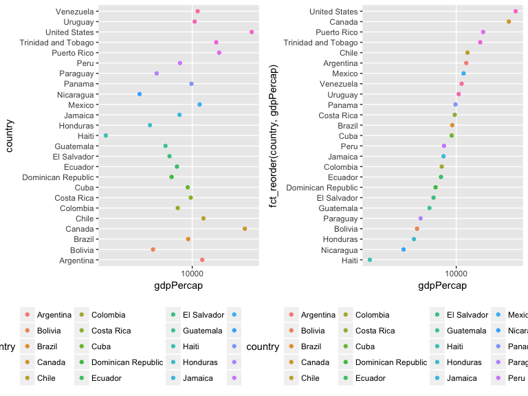
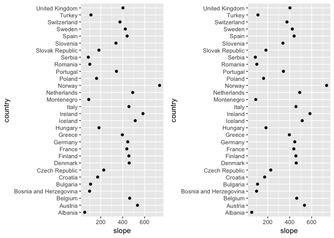
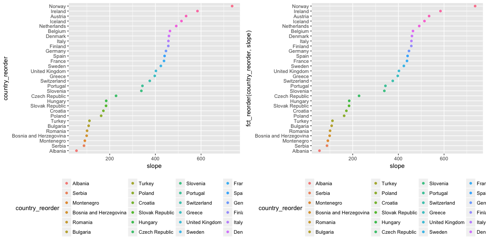
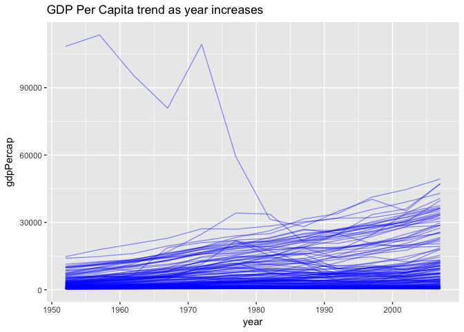
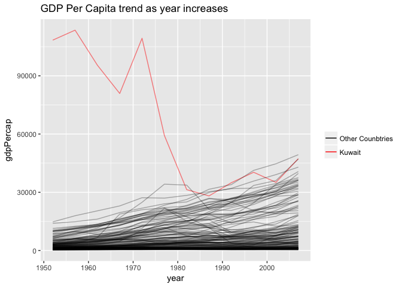
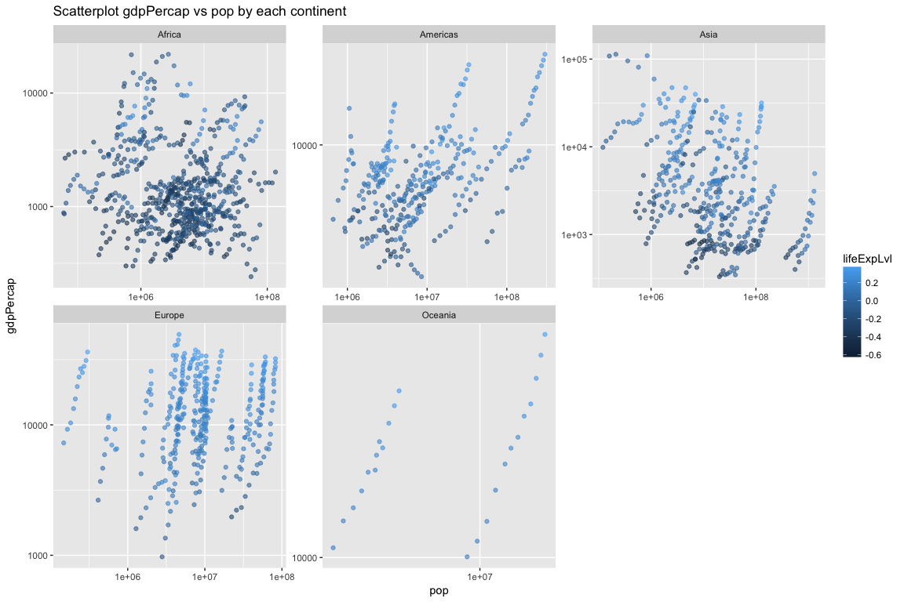
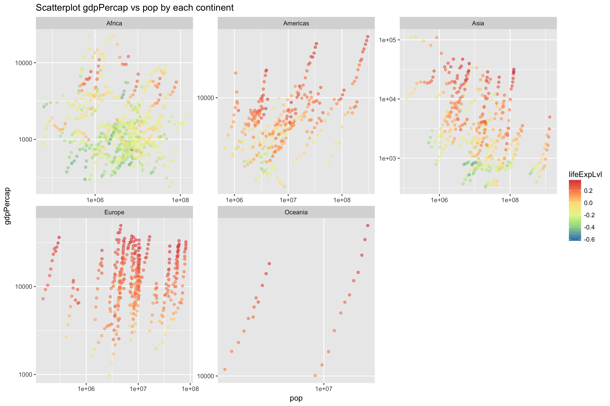

HW5: Factor and figure management; Repo hygiene
================

Pre-Work
--------

#### Load packages

Load the necessary package (assuming you have installed them)

``` r
library(dplyr)
library(ggplot2)
library(forcats)
library(gapminder)
library(gridExtra)
library(RColorBrewer)
library(gdata)
```

Problem 1: Factor management
----------------------------

#### Task 1.1: Drop `Oceania`

Filter out the continent `Oceania` first in preparation for the following work.

``` r
levels(gapminder$continent)
```

    ## [1] "Africa"   "Americas" "Asia"     "Europe"   "Oceania"

``` r
gapmdr_filter <- 
  gapminder %>%
  filter(continent != "Oceania")
levels(gapmdr_filter$continent) 
```

    ## [1] "Africa"   "Americas" "Asia"     "Europe"   "Oceania"

It could be seen that the variable `continent` still has 5 levels, even though we removed the observations whose `continent` belongs to `Oceania`.

Start dropping the unuseful levels for the variable `Oceania`.

``` r
gapmdr_filter$continent %>%
  fct_drop() %>%
  levels()
```

    ## [1] "Africa"   "Americas" "Asia"     "Europe"

``` r
gapmdr_dropLvl <- 
  gapmdr_filter %>%
  droplevels()
levels(gapmdr_dropLvl$continent)
```

    ## [1] "Africa"   "Americas" "Asia"     "Europe"

Both functions `fct_drop()` and `droplevels()` can drop unused factor levels, but `fct_drop()` is used for a factor, but `droplevels()` can operate on either a factor or a data frame.

#### Task 1.2: Recorder the levels of `continent`

``` r
gapmdr_dropLvl$continent%>%
  levels() 
```

    ## [1] "Africa"   "Americas" "Asia"     "Europe"

By default, the levels are ordered alphabetically.

Now we reorder the country levels based on the median of `gdpPercap` in a descending order.

``` r
fct_reorder(gapmdr_dropLvl$continent, 
            gapmdr_dropLvl$gdpPercap, .desc = TRUE) %>%
  levels() 
```

    ## [1] "Europe"   "Americas" "Asia"     "Africa"

Plot before and after reorder, for simplicity and the beauty of the graph, we only reorder and plot the variable `country` in the continent of `Americas` for the year 2007

``` r
gap_am_2007 <- gapminder %>%
  filter(year == 2007, continent == "Americas")

p1 <- ggplot(gap_am_2007, aes(x = gdpPercap, y = country)) + geom_point(aes(color = country), alpha = 0.8) + scale_x_log10() + theme(legend.position="bottom")
p2 <- ggplot(gap_am_2007, aes(x = gdpPercap, y = fct_reorder(country, gdpPercap))) +
  geom_point(aes(color = country), alpha = 0.8) + scale_x_log10() + theme(legend.position="bottom")
grid.arrange(p1, p2, ncol=2)
```



Task 1.3 (Extra)
----------------

Instead of using the default median, I can explore some more, using gapminder data, not the one with dropped levels

For example, reorder the `country` based on its average gdp increase rate across all years available.

``` r
gpmdr_slope<- 
  gapminder %>%
  group_by(country) %>% 
  do(fit = lm(gdpPercap ~ year, .)) %>% 
  summarise(country = country, intercept = coef(fit)[1],  slope= coef(fit)[2])

fct_reorder(gpmdr_slope$country, 
            gpmdr_slope$slope, .desc = TRUE) %>%
  levels() %>%
  head(30)
```

    ##  [1] "Singapore"        "Norway"           "Hong Kong, China"
    ##  [4] "Ireland"          "Japan"            "Austria"         
    ##  [7] "United States"    "Iceland"          "Taiwan"          
    ## [10] "Netherlands"      "Belgium"          "Denmark"         
    ## [13] "Italy"            "Finland"          "Canada"          
    ## [16] "Germany"          "Spain"            "France"          
    ## [19] "Australia"        "Sweden"           "Oman"            
    ## [22] "United Kingdom"   "Korea, Rep."      "Greece"          
    ## [25] "Israel"           "Switzerland"      "Portugal"        
    ## [28] "Slovenia"         "Puerto Rico"      "Bahrain"

For example: Reorder the factor `continent` based on its number of countries.

``` r
fct_reorder(gapminder$continent, 
            gapminder$country,fun = n_distinct, .desc = TRUE) %>%
  levels() 
```

    ## [1] "Africa"   "Asia"     "Europe"   "Americas" "Oceania"

#### Problem 2 Common Part

Task 2.1
--------

For simplicity, I am using a new dataset obtained from `gpmdr_slope` from Task 1.3 and `gapminder` for the following questions.

``` r
gpm <-
  gapminder %>%
  dplyr::select("continent", "country") %>%
  unique() %>%
  inner_join(gpmdr_slope, ., by = "country")
gpm_eur <- gpm %>%
  filter(continent == "Europe") %>%
  droplevels()

gpm_eur%>%
  knitr::kable(digits = 2, align ="r", padding = 10 )
```

|                 country|   intercept|   slope|  continent|
|-----------------------:|-----------:|-------:|----------:|
|                 Albania|   -104544.1|   54.46|     Europe|
|                 Austria|  -1037774.0|  534.57|     Europe|
|                 Belgium|   -898320.8|  463.87|     Europe|
|  Bosnia and Herzegovina|   -192269.9|   98.89|     Europe|
|                Bulgaria|   -206756.9|  107.67|     Europe|
|                 Croatia|   -331508.7|  172.19|     Europe|
|          Czech Republic|   -436852.4|  227.72|     Europe|
|                 Denmark|   -887732.4|  459.41|     Europe|
|                 Finland|   -886323.5|  456.58|     Europe|
|                  France|   -847598.5|  437.70|     Europe|
|                 Germany|   -863036.2|  446.37|     Europe|
|                  Greece|   -772269.1|  397.19|     Europe|
|                 Hungary|   -354472.5|  184.57|     Europe|
|                 Iceland|   -997466.0|  514.27|     Europe|
|                 Ireland|  -1141026.5|  584.38|     Europe|
|                   Italy|   -888466.8|  457.04|     Europe|
|              Montenegro|   -173054.3|   91.06|     Europe|
|             Netherlands|   -950756.9|  491.29|     Europe|
|                  Norway|  -1430486.9|  736.16|     Europe|
|                  Poland|   -313015.2|  162.38|     Europe|
|                Portugal|   -668146.6|  343.27|     Europe|
|                 Romania|   -192037.5|  100.70|     Europe|
|                  Serbia|   -163502.8|   87.30|     Europe|
|         Slovak Republic|   -353658.4|  183.92|     Europe|
|                Slovenia|   -656045.2|  338.53|     Europe|
|                   Spain|   -857599.7|  440.33|     Europe|
|                  Sweden|   -819287.0|  423.96|     Europe|
|             Switzerland|   -715956.6|  375.36|     Europe|
|                  Turkey|   -215742.4|  111.25|     Europe|
|          United Kingdom|   -777027.8|  402.33|     Europe|

``` r
levels(gpm_eur$country)
```

    ##  [1] "Albania"                "Austria"               
    ##  [3] "Belgium"                "Bosnia and Herzegovina"
    ##  [5] "Bulgaria"               "Croatia"               
    ##  [7] "Czech Republic"         "Denmark"               
    ##  [9] "Finland"                "France"                
    ## [11] "Germany"                "Greece"                
    ## [13] "Hungary"                "Iceland"               
    ## [15] "Ireland"                "Italy"                 
    ## [17] "Montenegro"             "Netherlands"           
    ## [19] "Norway"                 "Poland"                
    ## [21] "Portugal"               "Romania"               
    ## [23] "Serbia"                 "Slovak Republic"       
    ## [25] "Slovenia"               "Spain"                 
    ## [27] "Sweden"                 "Switzerland"           
    ## [29] "Turkey"                 "United Kingdom"

``` r
p3 <- ggplot(gpm_eur, aes(x = slope, y = country)) + geom_point() 

gpm_eur_arrange <-
  gpm_eur %>%
  arrange(slope)
gpm_eur_arrange %>%
  knitr::kable(digits = 2, align ="r", padding = 10 )
```

|                 country|   intercept|   slope|  continent|
|-----------------------:|-----------:|-------:|----------:|
|                 Albania|   -104544.1|   54.46|     Europe|
|                  Serbia|   -163502.8|   87.30|     Europe|
|              Montenegro|   -173054.3|   91.06|     Europe|
|  Bosnia and Herzegovina|   -192269.9|   98.89|     Europe|
|                 Romania|   -192037.5|  100.70|     Europe|
|                Bulgaria|   -206756.9|  107.67|     Europe|
|                  Turkey|   -215742.4|  111.25|     Europe|
|                  Poland|   -313015.2|  162.38|     Europe|
|                 Croatia|   -331508.7|  172.19|     Europe|
|         Slovak Republic|   -353658.4|  183.92|     Europe|
|                 Hungary|   -354472.5|  184.57|     Europe|
|          Czech Republic|   -436852.4|  227.72|     Europe|
|                Slovenia|   -656045.2|  338.53|     Europe|
|                Portugal|   -668146.6|  343.27|     Europe|
|             Switzerland|   -715956.6|  375.36|     Europe|
|                  Greece|   -772269.1|  397.19|     Europe|
|          United Kingdom|   -777027.8|  402.33|     Europe|
|                  Sweden|   -819287.0|  423.96|     Europe|
|                  France|   -847598.5|  437.70|     Europe|
|                   Spain|   -857599.7|  440.33|     Europe|
|                 Germany|   -863036.2|  446.37|     Europe|
|                 Finland|   -886323.5|  456.58|     Europe|
|                   Italy|   -888466.8|  457.04|     Europe|
|                 Denmark|   -887732.4|  459.41|     Europe|
|                 Belgium|   -898320.8|  463.87|     Europe|
|             Netherlands|   -950756.9|  491.29|     Europe|
|                 Iceland|   -997466.0|  514.27|     Europe|
|                 Austria|  -1037774.0|  534.57|     Europe|
|                 Ireland|  -1141026.5|  584.38|     Europe|
|                  Norway|  -1430486.9|  736.16|     Europe|

``` r
p4 <- ggplot(gpm_eur_arrange, aes(x = slope, y = country)) +
  geom_point()

grid.arrange(p3, p4, ncol=2)
```



From the following code, I found arrange() does not affect the order of `country`

``` r
which(!levels(gpm_eur$country) == levels(gpm_eur_arrange$country))
```

    ## integer(0)

I will arrange the slope again, but this time group by `continent`, and see what happens.

``` r
gpm_arrange_continent <-
  gpm %>%
  group_by(continent) %>%
  arrange(slope, .by_group = TRUE) %>%
  head(30) %>%
  knitr::kable(digits = 2, align ="r", padding = 10 )
```

Explore the effects of reording a factor and factor reording coupled with arrange().

``` r
gpm_eur_factor <- gpm_eur %>%
  mutate(country_reorder = fct_reorder(country, slope)) %>%
  dplyr::select(-country) 
gpm_eur_factor %>%
  knitr::kable(digits = 2, align ="r", padding = 10 )
```

|   intercept|   slope|  continent|        country\_reorder|
|-----------:|-------:|----------:|-----------------------:|
|   -104544.1|   54.46|     Europe|                 Albania|
|  -1037774.0|  534.57|     Europe|                 Austria|
|   -898320.8|  463.87|     Europe|                 Belgium|
|   -192269.9|   98.89|     Europe|  Bosnia and Herzegovina|
|   -206756.9|  107.67|     Europe|                Bulgaria|
|   -331508.7|  172.19|     Europe|                 Croatia|
|   -436852.4|  227.72|     Europe|          Czech Republic|
|   -887732.4|  459.41|     Europe|                 Denmark|
|   -886323.5|  456.58|     Europe|                 Finland|
|   -847598.5|  437.70|     Europe|                  France|
|   -863036.2|  446.37|     Europe|                 Germany|
|   -772269.1|  397.19|     Europe|                  Greece|
|   -354472.5|  184.57|     Europe|                 Hungary|
|   -997466.0|  514.27|     Europe|                 Iceland|
|  -1141026.5|  584.38|     Europe|                 Ireland|
|   -888466.8|  457.04|     Europe|                   Italy|
|   -173054.3|   91.06|     Europe|              Montenegro|
|   -950756.9|  491.29|     Europe|             Netherlands|
|  -1430486.9|  736.16|     Europe|                  Norway|
|   -313015.2|  162.38|     Europe|                  Poland|
|   -668146.6|  343.27|     Europe|                Portugal|
|   -192037.5|  100.70|     Europe|                 Romania|
|   -163502.8|   87.30|     Europe|                  Serbia|
|   -353658.4|  183.92|     Europe|         Slovak Republic|
|   -656045.2|  338.53|     Europe|                Slovenia|
|   -857599.7|  440.33|     Europe|                   Spain|
|   -819287.0|  423.96|     Europe|                  Sweden|
|   -715956.6|  375.36|     Europe|             Switzerland|
|   -215742.4|  111.25|     Europe|                  Turkey|
|   -777027.8|  402.33|     Europe|          United Kingdom|

``` r
gpm_eur_factor_arrange <- gpm_eur_factor %>%
  arrange(slope) 
gpm_eur_factor_arrange %>%
  knitr::kable(digits = 2, align ="r", padding = 10 )
```

|   intercept|   slope|  continent|        country\_reorder|
|-----------:|-------:|----------:|-----------------------:|
|   -104544.1|   54.46|     Europe|                 Albania|
|   -163502.8|   87.30|     Europe|                  Serbia|
|   -173054.3|   91.06|     Europe|              Montenegro|
|   -192269.9|   98.89|     Europe|  Bosnia and Herzegovina|
|   -192037.5|  100.70|     Europe|                 Romania|
|   -206756.9|  107.67|     Europe|                Bulgaria|
|   -215742.4|  111.25|     Europe|                  Turkey|
|   -313015.2|  162.38|     Europe|                  Poland|
|   -331508.7|  172.19|     Europe|                 Croatia|
|   -353658.4|  183.92|     Europe|         Slovak Republic|
|   -354472.5|  184.57|     Europe|                 Hungary|
|   -436852.4|  227.72|     Europe|          Czech Republic|
|   -656045.2|  338.53|     Europe|                Slovenia|
|   -668146.6|  343.27|     Europe|                Portugal|
|   -715956.6|  375.36|     Europe|             Switzerland|
|   -772269.1|  397.19|     Europe|                  Greece|
|   -777027.8|  402.33|     Europe|          United Kingdom|
|   -819287.0|  423.96|     Europe|                  Sweden|
|   -847598.5|  437.70|     Europe|                  France|
|   -857599.7|  440.33|     Europe|                   Spain|
|   -863036.2|  446.37|     Europe|                 Germany|
|   -886323.5|  456.58|     Europe|                 Finland|
|   -888466.8|  457.04|     Europe|                   Italy|
|   -887732.4|  459.41|     Europe|                 Denmark|
|   -898320.8|  463.87|     Europe|                 Belgium|
|   -950756.9|  491.29|     Europe|             Netherlands|
|   -997466.0|  514.27|     Europe|                 Iceland|
|  -1037774.0|  534.57|     Europe|                 Austria|
|  -1141026.5|  584.38|     Europe|                 Ireland|
|  -1430486.9|  736.16|     Europe|                  Norway|

``` r
levels(gpm_eur_factor_arrange$country_reorder)
```

    ##  [1] "Albania"                "Serbia"                
    ##  [3] "Montenegro"             "Bosnia and Herzegovina"
    ##  [5] "Romania"                "Bulgaria"              
    ##  [7] "Turkey"                 "Poland"                
    ##  [9] "Croatia"                "Slovak Republic"       
    ## [11] "Hungary"                "Czech Republic"        
    ## [13] "Slovenia"               "Portugal"              
    ## [15] "Switzerland"            "Greece"                
    ## [17] "United Kingdom"         "Sweden"                
    ## [19] "France"                 "Spain"                 
    ## [21] "Germany"                "Finland"               
    ## [23] "Italy"                  "Denmark"               
    ## [25] "Belgium"                "Netherlands"           
    ## [27] "Iceland"                "Austria"               
    ## [29] "Ireland"                "Norway"

``` r
p5 <- ggplot(gpm_eur_factor, aes(x = slope, y = country_reorder)) + geom_point(aes(color = country_reorder), alpha = 0.8) + theme(legend.position="bottom")

p6 <- ggplot(gpm_eur_factor_arrange, aes(x = slope, y = fct_reorder(country_reorder, slope))) + geom_point(aes(color = country_reorder), alpha = 0.8) + theme(legend.position="bottom")
grid.arrange(p5, p6, ncol=2)
```



The above illustration shows that for our particular usage of `arrange()` function, it does not affect the figures. However, because it is really hard to tell in tables after re-order the factors, I think we'd better add arrange() after re-order the levels.

Problem 3: File I/O
-------------------

For simplicity, I play with the tibble created in the previous questions. I will firstly show the csv.

``` r
levels(gpm_eur_factor$country_reorder)
```

\[1\] "Albania" "Serbia"
\[3\] "Montenegro" "Bosnia and Herzegovina" \[5\] "Romania" "Bulgaria"
\[7\] "Turkey" "Poland"
\[9\] "Croatia" "Slovak Republic"
\[11\] "Hungary" "Czech Republic"
\[13\] "Slovenia" "Portugal"
\[15\] "Switzerland" "Greece"
\[17\] "United Kingdom" "Sweden"
\[19\] "France" "Spain"
\[21\] "Germany" "Finland"
\[23\] "Italy" "Denmark"
\[25\] "Belgium" "Netherlands"
\[27\] "Iceland" "Austria"
\[29\] "Ireland" "Norway"

``` r
write.csv(gpm_eur_factor, file = "Non-alphabetically_orderedCSV")
gpm_eur_factor_CSVcopy <- read.csv("Non-alphabetically_orderedCSV")
levels(gpm_eur_factor_CSVcopy$country_reorder)
```

\[1\] "Albania" "Austria"
\[3\] "Belgium" "Bosnia and Herzegovina" \[5\] "Bulgaria" "Croatia"
\[7\] "Czech Republic" "Denmark"
\[9\] "Finland" "France"
\[11\] "Germany" "Greece"
\[13\] "Hungary" "Iceland"
\[15\] "Ireland" "Italy"
\[17\] "Montenegro" "Netherlands"
\[19\] "Norway" "Poland"
\[21\] "Portugal" "Romania"
\[23\] "Serbia" "Slovak Republic"
\[25\] "Slovenia" "Spain"
\[27\] "Sweden" "Switzerland"
\[29\] "Turkey" "United Kingdom"

It shows that saving as csv does not preserve the factor levels, instead, it automatically ordered in alphabetical order.

``` r
saveRDS(gpm_eur_factor, file = "Non-alphabetically_orderedRDS")
gpm_eur_factor_RDScopy <- readRDS("Non-alphabetically_orderedRDS")
levels(gpm_eur_factor_RDScopy$country_reorder)
```

    ##  [1] "Albania"                "Serbia"                
    ##  [3] "Montenegro"             "Bosnia and Herzegovina"
    ##  [5] "Romania"                "Bulgaria"              
    ##  [7] "Turkey"                 "Poland"                
    ##  [9] "Croatia"                "Slovak Republic"       
    ## [11] "Hungary"                "Czech Republic"        
    ## [13] "Slovenia"               "Portugal"              
    ## [15] "Switzerland"            "Greece"                
    ## [17] "United Kingdom"         "Sweden"                
    ## [19] "France"                 "Spain"                 
    ## [21] "Germany"                "Finland"               
    ## [23] "Italy"                  "Denmark"               
    ## [25] "Belgium"                "Netherlands"           
    ## [27] "Iceland"                "Austria"               
    ## [29] "Ireland"                "Norway"

``` r
which( !levels(gpm_eur_factor_RDScopy$country_reorder) == 
         levels(gpm_eur_factor$country_reorder))
```

    ## integer(0)

It shows that saving as RDS does preserve the factor levels.

``` r
dput(gpm_eur_factor, file = "Non-alphabetically_ordereddput")
gpm_eur_factor_dputCopy <- dget("Non-alphabetically_ordereddput")
levels(gpm_eur_factor_dputCopy$country_reorder)
```

    ##  [1] "Albania"                "Serbia"                
    ##  [3] "Montenegro"             "Bosnia and Herzegovina"
    ##  [5] "Romania"                "Bulgaria"              
    ##  [7] "Turkey"                 "Poland"                
    ##  [9] "Croatia"                "Slovak Republic"       
    ## [11] "Hungary"                "Czech Republic"        
    ## [13] "Slovenia"               "Portugal"              
    ## [15] "Switzerland"            "Greece"                
    ## [17] "United Kingdom"         "Sweden"                
    ## [19] "France"                 "Spain"                 
    ## [21] "Germany"                "Finland"               
    ## [23] "Italy"                  "Denmark"               
    ## [25] "Belgium"                "Netherlands"           
    ## [27] "Iceland"                "Austria"               
    ## [29] "Ireland"                "Norway"

``` r
which( !levels(gpm_eur_factor_dputCopy$country_reorder) == 
         levels(gpm_eur_factor$country_reorder))
```

    ## integer(0)

It shows that saving using dput does preserve the factor levels.

Problem 4: Visualization design
-------------------------------

#### Plotting the trend of GDP increase per year for countries

Before

``` r
ggplot(gapminder, aes(x= year, y = gdpPercap, group= country)) + 
  geom_line(alpha = 0.4) +
  ggtitle("GDP Per Capita trend as year increases")
```



After

``` r
color_layer <- scale_color_manual("", #title of the legend
                                  labels = c("Other Counbtries", "Kuwait"), 
                                  values = c(brewer.pal(n=2, "Dark2")))

ggplot(gapminder, aes(x= year, y = gdpPercap, group = country)) + 
  geom_line(aes(group = country, 
                color = country == "Kuwait",
                alpha = country == "Kuwait")) +
  color_layer +
  scale_alpha_discrete(range = c(0.3, 0.5),
                       guide = FALSE) +
  ggtitle("GDP Per Capita trend as year increases")
```

    ## Warning in brewer.pal(n = 2, "Dark2"): minimal value for n is 3, returning requested palette with 3 different levels



#### Jitter plotting the gdpPercap by year.

Before

``` r
gapminder %>%
  mutate(lifeExpLvl=(lifeExp-mean(lifeExp))/mean(lifeExp)) %>%
  ggplot(aes(x = pop, y = gdpPercap)) + 
  geom_point(alpha  = .6, aes(color = lifeExpLvl)) + 
  scale_y_log10() + 
  scale_x_log10() +
  facet_wrap(~ continent, scales = "free") + 
  ggtitle("Scatterplot gdpPercap vs pop by each continent")
```



After

``` r
forGGSave<- 
  gapminder %>%
  mutate(lifeExpLvl=(lifeExp-mean(lifeExp))/mean(lifeExp)) %>%
  ggplot(aes(x = pop, y = gdpPercap)) + 
  geom_point(alpha  = .6, aes(color = lifeExpLvl)) + 
  scale_y_log10() + 
  scale_x_log10() +
  facet_wrap(~ continent, scales = "free") + 
  ggtitle("Scatterplot gdpPercap vs pop by each continent") +
  scale_colour_distiller(palette="Spectral")
```

Problem 5: Writing figures to file
----------------------------------

``` r
ggsave("ggSave.png", width = 12, height = 7, plot = forGGSave)
```

Below figure is retrieved from the code ``. 

Problem 6: But I want to do more
--------------------------------

``` r
favFood <- data.frame(
  country = c("Germany", "Japan", "Korea, Rep.", 
              "China", "United States", "France"),
  food = c("Beer", "Sushi", "BBQ", 
           "Hotpot", "Burger", "Steak"),
  stringsAsFactors=TRUE)

slope_small <-
  gpmdr_slope %>%
  filter(country %in% c("Germany", "Japan", "Korea, Rep.", 
                        "China", "United States", "France")) %>%
  droplevels()%>%
  left_join(., favFood, by = "country") 

levels(slope_small$country)
```

    ## [1] "China"         "France"        "Germany"       "Japan"        
    ## [5] "Korea, Rep."   "United States"

``` r
levels(slope_small$food) 
```

    ## [1] "BBQ"    "Beer"   "Burger" "Hotpot" "Steak"  "Sushi"

It can been seen that both factor `country` and `food` are arranged alphabetically, and not matching each other. Let's reorder them and let them match with each order.

``` r
fct_relevel(slope_small$food, as.character(slope_small$food))
```

    ## [1] Hotpot Steak  Beer   Sushi  BBQ    Burger
    ## Levels: Hotpot Steak Beer Sushi BBQ Burger

``` r
fct_relevel(slope_small$country, as.character(slope_small$country))
```

    ## [1] China         France        Germany       Japan         Korea, Rep.  
    ## [6] United States
    ## Levels: China France Germany Japan Korea, Rep. United States

Now they are mapping to each other.

``` r
levels(slope_small$country) 
```

    ## [1] "China"         "France"        "Germany"       "Japan"        
    ## [5] "Korea, Rep."   "United States"

``` r
levels(slope_small$food)
```

    ## [1] "BBQ"    "Beer"   "Burger" "Hotpot" "Steak"  "Sushi"

Report your process
-------------------

This homework in general is a little hard compared to the others because my experience in manipulating with factors is limited. Meanwhile, I challenged myself in Taks 1.3 when reordering the `country` based on its average gdp increase rate across all years available. My first thought is to build up a function and then use apply. My function of recording the increase per year is as follows:

``` r
gdpIncrease <- function(countryDat) {
  year.min <- min(countryDat[,"year"])
  year.max <- max(countryDat[,"year"])
  year.count <- n_distinct(countryDat[,"year"])
  cntryUseful <- 
    countryDat %>%
    filter(year %in% c(year.min, year.max)) %>%
    mutate(
      totalGDP = gdpPercap * pop,
      lagtotalGPD = lag(totalGDP),
      incRate = (totalGDP - lagtotalGPD) / (year.max - year.min)
    ) %>%
    na.omit()
  return(mean(cntryUseful[1,"incRate"]))
}
```

However, when I use the function `apply()`, there is a problem

``` r
a<- as.matrix(gapminder[c(1:12),-c(1:2)])
apply(a,  MARGIN=c(4, 12), FUN = function(x) gdpIncrease(x))
```

I spent almost two days in figuring out why it is the case, but still achieve nothing. So I tackled the problem with another method: fitting the linear model as you see. But any help with this debugging will be appreciated!

Also, because I have loaded MASS library and dplyr library, when I was using select(), I got error message: `Error in select(., "year") : unused argument ("year")`. After searching stackoverflow, I finnally got that two libraries both have the function select(), so R was confusing when I didn't specify which library want for the select() function.
